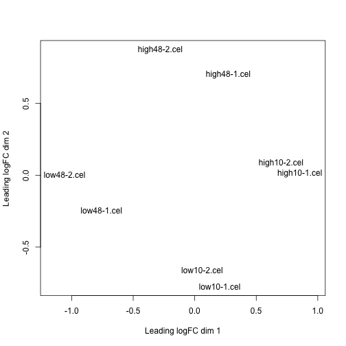
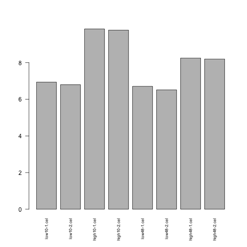

The purpose of this exercise is to understand a few more details of a standard 'limma' differential expression (DE) analysis.  In particular, we will explore: 
  1. the combination of design matrices and contrast matrices to answer DE questions-of-interest
  2. some of the preprocessing steps (and the concepts leading to them) for Affymetrix microarray data.
  
If you need additional resources to understand this exercise or the methods behind it, it is strongly encourage to read both the [http://www.statsci.org/smyth/pubs/ebayes.pdf](limma paper) (as given in class) and the [https://www.bioconductor.org/packages/release/bioc/vignettes/limma/inst/doc/usersguide.pdf](limma user's guide).


```r
library("limma")
library("affy")
library("preprocessCore")
unzip("affy_estrogen.zip")
ddir <- "affy_estrogen"
dir(ddir)
```

```
## [1] "high10-1.cel" "high10-2.cel" "high48-1.cel" "high48-2.cel"
## [5] "low10-1.cel"  "low10-2.cel"  "low48-1.cel"  "low48-2.cel" 
## [9] "targets.txt"
```

It is generally good practice to store the details of an experiment (e.g., the set of samples) in a machine-readable table, like the provided ``targets.txt'' file; this is known as **metadata**.  Have a look at this file in a text editor or a spreadsheet to see what kind of information is typically described.  The following code reads in this metadata file, reads in the Affymetrix data and processes it with a popular method called RMA (robust multichip analysis); some of the details of RMA are reverse-engineered below.


```r
# preprocess affymetrix data
targets <- readTargets("targets.txt", path=ddir)
targets
```

```
##       filename estrogen time.h
## 1  low10-1.cel   absent     10
## 2  low10-2.cel   absent     10
## 3 high10-1.cel  present     10
## 4 high10-2.cel  present     10
## 5  low48-1.cel   absent     48
## 6  low48-2.cel   absent     48
## 7 high48-1.cel  present     48
## 8 high48-2.cel  present     48
```

```r
abatch <- ReadAffy(filenames=targets$filename,
                   celfile.path=ddir)
eset <- rma(abatch)  # bg correct, normalize, summarize
```

```
## Background correcting
## Normalizing
## Calculating Expression
```


It is always good practice to look at overall summaries of a large dataset, such as a multidimensional scaling (MDS) plot to get an idea of the relations between samples.  In this case, "distances on the plot approximate the typical log2 fold changes" (?plotMDS):


```r
plotMDS( exprs(eset) )  # MDS plot
```

 

In order to run the standard limma pipeline for differential expression, we need a design matrix and optionally, a contrast matrix.  In the code below, the metadata is encoded into a factor variable that is used for creating the design matrix.  It is suggested to look at and understand the design matrix before proceeding.


```r
# do the limma modeling
f <- paste(targets$estrogen,targets$time.h,sep="")
f <- factor(f)

# create design matrix
design <- model.matrix(~0+f)
colnames(design) <- levels(f)
design
```

```
##   absent10 absent48 present10 present48
## 1        1        0         0         0
## 2        1        0         0         0
## 3        0        0         1         0
## 4        0        0         1         0
## 5        0        1         0         0
## 6        0        1         0         0
## 7        0        0         0         1
## 8        0        0         0         1
## attr(,"assign")
## [1] 1 1 1 1
## attr(,"contrasts")
## attr(,"contrasts")$f
## [1] "contr.treatment"
```

From the design matrix, we can now **fit** the linear model:


```r
fit <- lmFit(eset, design)
```

To ask questions about the parameters defined in the design matrix, we can now define a **contrast** matrix, which can be constructed by hand or using the makeContrasts() accessory function.  Again, it is suggested to study this matrix and make sure you understand what it is doing before proceeding.


```r
cont.matrix <- makeContrasts(E10="present10-absent10",
                             E48="present48-absent48",
                             Time="absent48-absent10",levels=design)
cont.matrix
```

```
##            Contrasts
## Levels      E10 E48 Time
##   absent10   -1   0   -1
##   absent48    0  -1    1
##   present10   1   0    0
##   present48   0   1    0
```

Now, the contrasts can be fit and the moderation of the variance parameters (as discussed in lectures) can be performed:


```r
fit2  <- contrasts.fit(fit, cont.matrix)
fit2  <- eBayes(fit2)
fit2
```

```
## An object of class "MArrayLM"
## $coefficients
##            Contrasts
##                     E10         E48       Time
##   100_g_at  -0.24686537 -0.07791790 -0.1110524
##   1000_at   -0.37251645 -0.09999976 -0.1220724
##   1001_at    0.10748492  0.14242137  0.1914043
##   1002_f_at -0.06760315  0.12681750 -0.2149139
##   1003_s_at  0.04060842  0.08145908  0.1367273
## 12620 more rows ...
## 
## $rank
## [1] 4
## 
## $assign
## [1] 1 1 1 1
## 
## $qr
## $qr
##     absent10   absent48  present10  present48
## 1 -1.4142136  0.0000000  0.0000000  0.0000000
## 2  0.7071068 -1.4142136  0.0000000  0.0000000
## 3  0.0000000  0.0000000 -1.4142136  0.0000000
## 4  0.0000000  0.0000000  0.7071068 -1.4142136
## 5  0.0000000  0.7071068  0.0000000  0.0000000
## 6  0.0000000  0.7071068  0.0000000  0.0000000
## 7  0.0000000  0.0000000  0.0000000  0.7071068
## 8  0.0000000  0.0000000  0.0000000  0.7071068
## attr(,"assign")
## [1] 1 1 1 1
## attr(,"contrasts")
## attr(,"contrasts")$f
## [1] "contr.treatment"
## 
## 
## $qraux
## [1] 1.707107 1.000000 1.707107 1.000000
## 
## $pivot
## [1] 1 2 3 4
## 
## $tol
## [1] 1e-07
## 
## $rank
## [1] 4
## 
## 
## $df.residual
## [1] 4 4 4 4 4
## 12620 more elements ...
## 
## $sigma
##   100_g_at    1000_at    1001_at  1002_f_at  1003_s_at 
## 0.07649887 0.21776253 0.12832927 0.11769183 0.15544260 
## 12620 more elements ...
## 
## $cov.coefficients
##          Contrasts
## Contrasts E10  E48 Time
##      E10  1.0  0.0  0.5
##      E48  0.0  1.0 -0.5
##      Time 0.5 -0.5  1.0
## 
## $stdev.unscaled
##            Contrasts
##             E10 E48 Time
##   100_g_at    1   1    1
##   1000_at     1   1    1
##   1001_at     1   1    1
##   1002_f_at   1   1    1
##   1003_s_at   1   1    1
## 12620 more rows ...
## 
## $Amean
##  100_g_at   1000_at   1001_at 1002_f_at 1003_s_at 
##  9.555474 10.147100  5.957489  5.564548  7.994831 
## 12620 more elements ...
## 
## $method
## [1] "ls"
## 
## $design
##   absent10 absent48 present10 present48
## 1        1        0         0         0
## 2        1        0         0         0
## 3        0        0         1         0
## 4        0        0         1         0
## 5        0        1         0         0
## 6        0        1         0         0
## 7        0        0         0         1
## 8        0        0         0         1
## attr(,"assign")
## [1] 1 1 1 1
## attr(,"contrasts")
## attr(,"contrasts")$f
## [1] "contr.treatment"
## 
## 
## $contrasts
##            Contrasts
## Levels      E10 E48 Time
##   absent10   -1   0   -1
##   absent48    0  -1    1
##   present10   1   0    0
##   present48   0   1    0
## 
## $df.prior
## [1] 4.479981
## 
## $s2.prior
## [1] 0.02199399
## 
## $var.prior
## [1] 65.01775 93.87792 52.61593
## 
## $proportion
## [1] 0.01
## 
## $s2.post
##   100_g_at    1000_at    1001_at  1002_f_at  1003_s_at 
## 0.01437986 0.03398766 0.01938757 0.01815312 0.02301683 
## 12620 more elements ...
## 
## $t
##            Contrasts
##                    E10        E48       Time
##   100_g_at  -2.0586514 -0.6497704 -0.9260848
##   1000_at   -2.0206207 -0.5424233 -0.6621509
##   1001_at    0.7719440  1.0228535  1.3746428
##   1002_f_at -0.5017545  0.9412468 -1.5951037
##   1003_s_at  0.2676661  0.5369289  0.9012233
## 12620 more rows ...
## 
## $df.total
## [1] 8.479981 8.479981 8.479981 8.479981 8.479981
## 12620 more elements ...
## 
## $p.value
##            Contrasts
##                    E10       E48      Time
##   100_g_at  0.07153470 0.5330438 0.3800031
##   1000_at   0.07597743 0.6014878 0.5254577
##   1001_at   0.46111710 0.3346688 0.2044708
##   1002_f_at 0.62860708 0.3726157 0.1472181
##   1003_s_at 0.79535224 0.6051150 0.3923460
## 12620 more rows ...
## 
## $lods
##            Contrasts
##                   E10       E48      Time
##   100_g_at  -4.804654 -6.643594 -6.138313
##   1000_at   -4.861525 -6.711478 -6.351663
##   1001_at   -6.373222 -6.326130 -5.652146
##   1002_f_at -6.553538 -6.405619 -5.368735
##   1003_s_at -6.650810 -6.714647 -6.160958
## 12620 more rows ...
## 
## $F
## [1] 1.5861664 1.4629910 2.0475707 0.8880226 0.8353092
## 12620 more elements ...
## 
## $F.p.value
## [1] 0.2634847 0.2922784 0.1817192 0.4855166 0.5094259
## 12620 more elements ...
```

```r
class(fit2)
```

```
## [1] "MArrayLM"
## attr(,"package")
## [1] "limma"
```

```r
names(fit2)
```

```
##  [1] "coefficients"     "rank"             "assign"          
##  [4] "qr"               "df.residual"      "sigma"           
##  [7] "cov.coefficients" "stdev.unscaled"   "Amean"           
## [10] "method"           "design"           "contrasts"       
## [13] "df.prior"         "s2.prior"         "var.prior"       
## [16] "proportion"       "s2.post"          "t"               
## [19] "df.total"         "p.value"          "lods"            
## [22] "F"                "F.p.value"
```

At this point, a lot of elements have now been added to the ``fit2'' object and it would again be worth studying the details.  See if you can understand what the different components are and if you need more details, type ?"MArrayLM-class" to see more information.

Next, we wish to compute the differential expression statistics, such as moderated-t and F statistics and perhaps some P-values.  The topTable() function has many facilities for this:


```r
topTable(fit2,coef=1)
```

```
##              logFC   AveExpr        t      P.Value    adj.P.Val        B
## 39642_at  2.939428  7.876515 23.71715 4.741579e-09 3.128295e-05 9.966810
## 910_at    3.113733  9.660238 23.59225 4.955715e-09 3.128295e-05 9.942522
## 31798_at  2.800195 12.115778 16.38509 1.025747e-07 3.511070e-04 7.977290
## 41400_at  2.381040 10.041553 16.22463 1.112418e-07 3.511070e-04 7.916921
## 40117_at  2.555282  9.676557 15.68070 1.472942e-07 3.576234e-04 7.705093
## 1854_at   2.507616  8.532099 15.15848 1.945518e-07 3.576234e-04 7.490766
## 39755_at  1.679331 12.131839 15.06365 2.048314e-07 3.576234e-04 7.450643
## 1824_s_at 1.914637  9.238870 14.87915 2.266129e-07 3.576234e-04 7.371475
## 1126_s_at 1.782825  6.879918 13.83040 4.119252e-07 5.778395e-04 6.892307
## 1536_at   2.662258  5.937222 13.26247 5.795111e-07 7.316327e-04 6.610486
```

```r
topTable(fit2,coef=2)
```

```
##              logFC   AveExpr         t      P.Value    adj.P.Val         B
## 910_at    3.855061  9.660238  29.20918 8.266125e-10 1.043598e-05 11.606193
## 31798_at  3.597334 12.115778  21.04947 1.284430e-08 7.631722e-05  9.890557
## 1854_at   3.340896  8.532099  20.19564 1.813478e-08 7.631722e-05  9.641399
## 38116_at  3.758891  9.513109  16.85669 8.116230e-08 2.511100e-04  8.480197
## 38065_at  2.993641  9.097183  16.20914 1.121213e-07 2.511100e-04  8.214175
## 39755_at  1.765249 12.131839  15.83434 1.359405e-07 2.511100e-04  8.053134
## 1592_at   2.296484  8.311330  15.78841 1.392293e-07 2.511100e-04  8.033025
## 41400_at  2.243510 10.041553  15.28749 1.814762e-07 2.752126e-04  7.808295
## 33730_at -2.041390  8.573470 -15.14298 1.961911e-07 2.752126e-04  7.741556
## 1651_at   2.968283 10.504276  14.78097 2.392480e-07 3.020507e-04  7.570470
```

Here, it is worth understanding exactly what "coef=1" or "coef=2" are testing before proceeding.  

It is also recommended to look at the data that goes into the statistical test in the first place.  For example, a simple barplot() goes a long way to helping interpret


```r
barplot( exprs(eset)["39642_at",], las=2, cex.names=.7 )  # top gene
```

 

#### Question 1. From the matrix of summarized Affymetrix data that went into the limma pipeline in the first place -- exprs(eset) -- manually calculate the logFC and AveExpr for one of the top differentially expressed genes.

Important side note: if you experiment is sufficiently simple (e.g., a 1-way design), you may not need a contrast matrix at all; the differential expression of interest can be  defined through column(s) of the design matrix (see discussion in the lecture notes).

#### Question 2. Create a Venn diagram summarizing the numbers of  differential genes for the 3 contrasts defined above 'E10', 'E48' and 'Time'.  Hint: use the decideTests() and vennDiagram() functions in limma (you can use default settings).  If you need more help using these functions, try: ?decideTests, ?vennDiagram
 
#### Question 3. Try to reproduce the above limma modeling using an **alternative design matrix** (remember, it's the combination of a design matrix and a contrast matrix).  Hint: use the experimental factors defined in the 'targets' data frame.

#### Note: Submit both an Rmarkdown/markdown file as well as a compiled HTML file to your private github repository.
