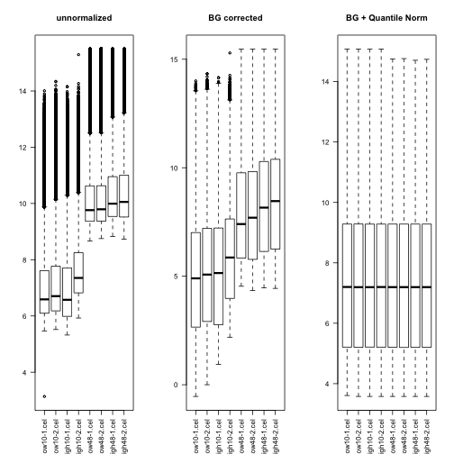
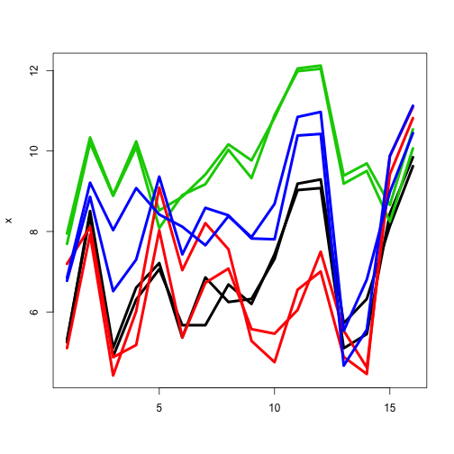

Note: we first start here with the data from Exercise 5.


```r
library("limma")
library("affy")
library("preprocessCore")
ddir <- "affy_estrogen"
dir(ddir)
```

```
## [1] "high10-1.cel" "high10-2.cel" "high48-1.cel" "high48-2.cel"
## [5] "low10-1.cel"  "low10-2.cel"  "low48-1.cel"  "low48-2.cel" 
## [9] "targets.txt"
```

```r
targets <- readTargets("targets.txt", path=ddir)
targets
```

```
##       filename estrogen time.h
## 1  low10-1.cel   absent     10
## 2  low10-2.cel   absent     10
## 3 high10-1.cel  present     10
## 4 high10-2.cel  present     10
## 5  low48-1.cel   absent     48
## 6  low48-2.cel   absent     48
## 7 high48-1.cel  present     48
## 8 high48-2.cel  present     48
```

```r
abatch <- ReadAffy(filenames=targets$filename,
                   celfile.path=ddir)
f <- paste(targets$estrogen,targets$time.h,sep="")
f <- factor(f)
```


Now, let us take a step back to see the "summarization" step of RMA starting from the raw "probe-level" data (i.e., multiple measurements per genes).  We will try and re-create the summaries using a robust linear regression.

These next two sections are just for your information.  We will not dig deeper into the specifics, but the details of RMA were briefly discussed in lectures.  RMA encompasses 3 steps: background correction, (quantile) normalization, summarization.


```r
pm <- probes(abatch,"pm")             # PM (perfect match) intensities
```

```
## Creating a generic function for 'nchar' from package 'base' in package 'S4Vectors'
```

```r
pm.bg <- rma.background.correct(pm)   # normexp BG correction
pm.bg.n <- normalize.quantiles(pm.bg) # quantile normalization

colnames(pm.bg) <- colnames(pm.bg.n) <- colnames(pm)
rownames(pm.bg) <- rownames(pm.bg.n) <- rownames(pm)
```

The next plots show how the data changes through normalization. Note: this is not exactly the same implementation as rma() function used above, but it is very similar:
 

```r
par(mfrow=c(1,3))
boxplot(as.data.frame(log2(pm)),las=2,main="unnormalized")
boxplot(as.data.frame(log2(pm.bg)),las=2,main="BG corrected")
boxplot(as.data.frame(log2(pm.bg.n)),las=2,main="BG + Quantile Norm")
```

 

Study the code below on how to extract the *probe-level* data for a single gene, "39642_at" from the background-adjusted, normalized probe-level data.


```r
# extracting probe-level data for 1 probeset (by name)
w <- grep("^39642_at",rownames(pm.bg.n))
x <- log2( pm.bg.n[w,] ) 

matplot(x, type="l", lty=1, lwd=4, col=f) # probe-level data
```

 

#### Question 1.  Pick a different (differentially expressed) gene, create a matrix 'x' as above and fit the RMA linear model using the median polish (see ?medpolish) or rlm (see ?rlm; MASS package) algorithm.  Plot the decomposition of probe-level data into "chip" effects, "probe" effects and residuals (e.g. a 4-panel figure, like that shown in lectures).  Compare your "chip" effect estimates to those used in the limma analysis from Exercise 5 -- corresponding row from exprs(eset).
